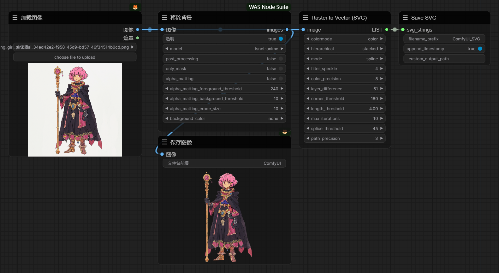
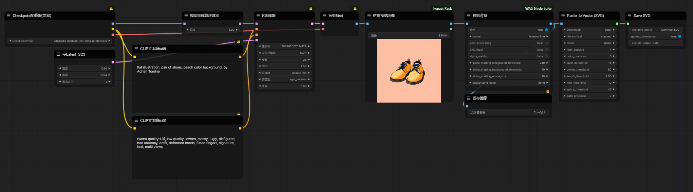
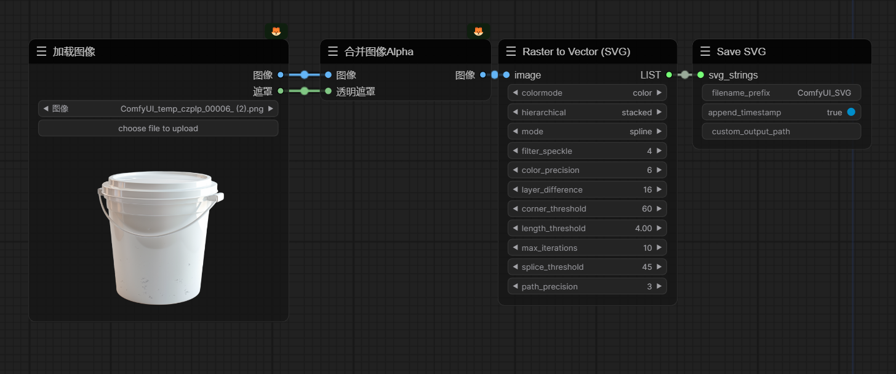

# ComfyUI-ToSVG
Huge thanks to visioncortex for this amazing thing! Original repository: https://github.com/lllyasviel/IC-Light](https://github.com/visioncortex/vtracer

## VTracer ComfyUI Non-Official Implementation

Welcome to the unofficial implementation of the ComfyUI for VTracer. This project converts raster images into SVG format using the VTracer library. It's a handy tool for designers and developers who need to work with vector graphics programmatically.

### Partial Parameter Description

- Filter Speckle (Cleaner)
- Color Precision (More accurate)
- Gradient Step (Less layers)
- Corner Threshold (Smoother)
- Segment Length (More coarse)
- Splice Threshold (Less accurate)

### Features

- Converts images to RGBA format if necessary
- Support batch conversion

- node `ConvertRasterToVector` to handle the conversion of raster images to SVG format with various parameters for customization.
- node `SaveSVG` to save the resulting SVG data into files.

### Workflow screenshot

- 
- 
- 

### What's next?

- [ ] Add SVG preview node

### Contributing

Contributions to this project are welcome. Please feel free to submit pull requests or create issues for any bugs or feature requests.

---

Enjoy converting your raster images to SVG with this handy tool! If you have any questions or need further assistance, don't hesitate to reach out.
