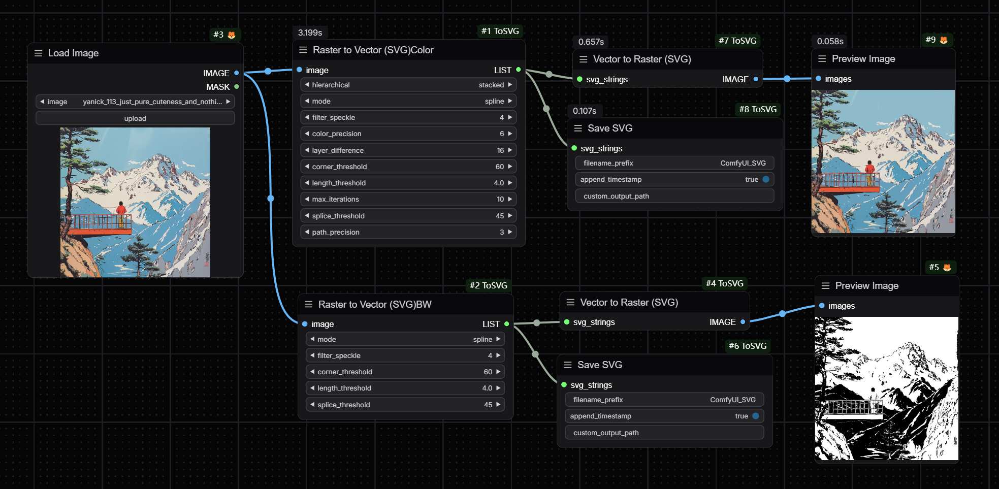

# ComfyUI-ToSVG

Huge thanks to visioncortex for this amazing thing! Original repository: https://github.com/visioncortex/vtracer




## Update
### 06-17

- This update is a destructive update. Please check carefully in the production environment!

- This update mainly coordinates with new SVG types introduced by ComfyUI and adjusts class naming methods to avoid conflicts with native ComfyUI nodes while adding nodes for mutual conversion with ComfyUI types.


## VTracer ComfyUI Non-Official Implementation

Welcome to the unofficial implementation of the ComfyUI for VTracer. This project converts raster images into SVG format using the VTracer library. It's a handy tool for designers and developers who need to work with vector graphics programmatically.

### Installation

1. Navigate to your `/ComfyUI/custom_nodes/` folder.
2. Run the following command to clone the repository:

```shell
git clone https://github.com/Yanick112/ComfyUI-ToSVG/
```

4. Navigate to your `ComfyUI-ToSVG` folder.

- For Portable/venv:
- Run the following command:
  ```shell
  path/to/ComfUI/python_embeded/python.exe -s -m pip install -r requirements.txt
  ```
- With system Python:
- Run the following command:
  ```shell
  pip install -r requirements.txt
  ```

Enjoy setting up your ComfyUI-ToSVG tool! If you encounter any issues or need further help, feel free to reach out.

### Partial Parameter Description

- Filter Speckle (Cleaner)
- Color Precision (More accurate)
- Gradient Step (Less layers)
- Corner Threshold (Smoother)
- Segment Length (More coarse)
- Splice Threshold (Less accurate)

### Features

- Converts images to RGBA format if necessary
- Support batch conversion

- node `ConvertRasterToVector` to handle the conversion of raster images to SVG format with various parameters for customization.
- node `SaveSVG` to save the resulting SVG data into files.

### What's next?

- [x] Add SVG preview node
- [x] Color and BW mode split

---

Enjoy converting your raster images to SVG with this handy tool! If you have any questions or need further assistance, don't hesitate to reach out.
